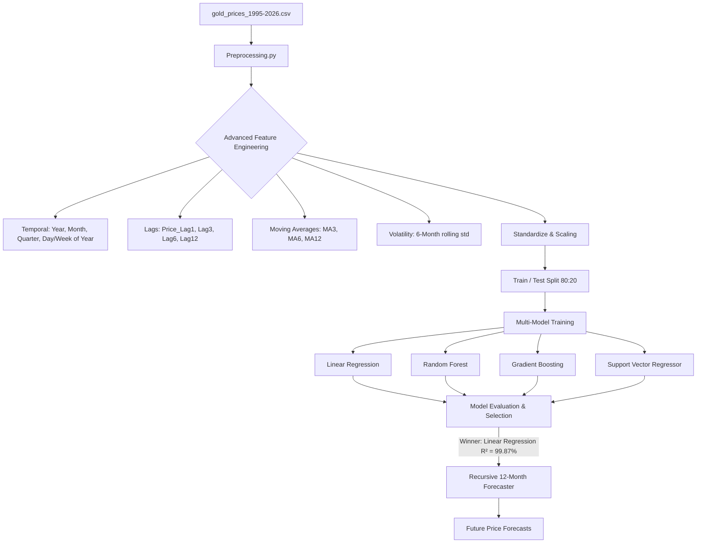

# 📈 Gold Price Predictor

[](https://www.python.org/)
[](https://scikit-learn.org/)
[](https://pandas.pydata.org/)
[](#)

A high-performance machine learning pipeline designed to analyze historical gold price trends (1995–2026) and forecast future prices. This project leverages multi-model regression analysis, advanced time-series feature engineering, and a recursive feedback forecasting loop to predict monthly gold prices.

---

## 🛠️ Project Architecture

The pipeline ingests raw monthly price data, cleans it, engineers custom lag and rolling features, trains four distinct regressors, selects the best-performing model, and predicts the gold price for the next 12 months recursively.



---

## 🌟 Key Features

*   **Data Preprocessing**: Auto-handles missing values, parses datetime formatting, removes duplicates, and standardizes numerical data using `StandardScaler`.
*   **Time-Series Feature Engineering**:
    *   **Temporal Features**: Extracts temporal components (Year, Month, Quarter, Day of Year, Week of Year).
    *   **Autoregressive Lag Features**: Creates lag steps at 1, 3, 6, and 12-month periods to capture trend dependency.
    *   **Rolling Statistics**: Evaluates 3, 6, and 12-month moving averages.
    *   **Market Volatility**: Derives volatility using rolling standard deviations.
*   **Multi-Model Engine**: Evaluates and compares four architectures: Linear Regression, Random Forest, Gradient Boosting, and Support Vector Regression (SVR).
*   **Recursive Multi-step Forecasting**: Predicts the next 12 months using a feedback loop where predicted values are fed back recursively to reconstruct lag and moving average features.

---

## 📂 Repository Structure

*   [gold_prices_1995-2026.csv](file:///C:/Users/Ashish%20sharma/Downloads/Gold_price_predictor/gold_prices_1995-2026.csv): Monthly historical gold price dataset in USD.
*   [Preprocessing.py](file:///C:/Users/Ashish%20sharma/Downloads/Gold_price_predictor/Preprocessing.py): Script focused on standard preprocessing, basic feature creation, scaling, and train-test splits.
*   [Prediction.py](file:///C:/Users/Ashish%20sharma/Downloads/Gold_price_predictor/Prediction.py): Core pipeline running advanced feature engineering, model training, evaluation, comparison, and recursive 12-month forecasting.

---

## 🚀 Getting Started

### 📋 Prerequisites

Ensure Python 3.8+ is installed on your system. Install the required libraries via `pip`:

```bash
pip install pandas numpy scikit-learn
```

### 🏃 Running the Pipeline

1.  **Run Preprocessing Analysis (Exploratory)**:
    ```bash
    python Preprocessing.py
    ```
2.  **Run Full Training, Comparison, and Forecasting Pipeline**:
    ```bash
    python Prediction.py
    ```

---

## 📊 Model Evaluation & Comparison

All models were evaluated on an 80/20 train-test split. **Linear Regression** achieved the highest generalization performance due to the strong linear relationships of the lag features.

| Model | Train $R^2$ | Test $R^2$ (Accuracy) | Test MAE | Test RMSE |
| :--- | :---: | :---: | :---: | :---: |
| 📈 **Linear Regression** | **99.86%** | **99.87%** | **$17.33** | **$23.20** |
| 🌲 Random Forest | 99.91% | 99.48% | $33.91 | $45.64 |
| ⚡ Gradient Boosting | 99.98% | 99.42% | $35.21 | $48.18 |
| 📉 SVR (RBF Kernel) | 73.35% | 93.54% | $84.08 | $161.18 |

> [!NOTE]
> Linear Regression outperforms tree-based models on forecasting here because gold price trends exhibit highly continuous autoregressive relationships. The single-month lag feature acts as an incredibly powerful linear predictor. SVR performs decently at 93.54% R² but exhibits higher errors.

---

## 🔮 12-Month Future Gold Price Forecast

Using the recursive **Linear Regression** model, the pipeline forecasts the following trends starting from the latest dataset point:

*   **Last Known Date**: Feb 01, 2026
*   **Last Known Price**: **$4,815.53**
*   **Average Predicted Price (Next 12 Months)**: **$4,708.36**
*   **Predicted Net Change**: **-$107.17 (-2.23%)**

### Monthly Projections

| Month | Predicted Price (USD) |
| :--- | :---: |
| **March 2026** | $4,707.48 |
| **April 2026** | $4,806.52 |
| **May 2026** | $4,719.51 |
| **June 2026** | $4,769.79 |
| **July 2026** | $4,705.92 |
| **August 2026** | $4,739.74 |
| **September 2026** | $4,686.62 |
| **October 2026** | $4,716.16 |
| **November 2026** | $4,666.08 |
| **December 2026** | $4,680.86 |
| **January 2027** | $4,633.51 |
| **February 2027** | $4,668.19 |

> [!TIP]
> The forecasted decrease of **-2.23%** indicates that gold prices are expected to experience a minor cooling period, stabilizing around the high $4,600s to low $4,800s over the next 12 months.
